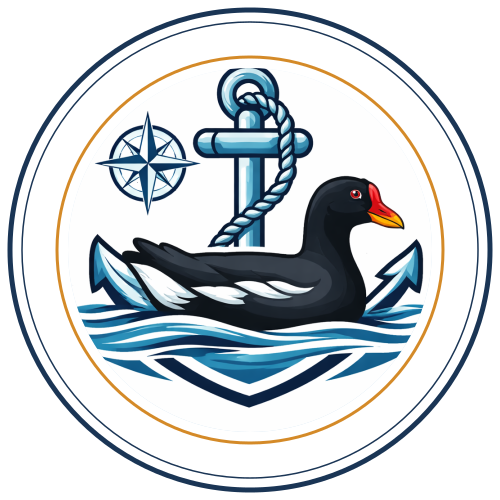

# AutoBoat Wiki — Autonomous Navigation for Unmanned Surface Vehicles

Welcome to the **AutoBoat Wiki**! This documentation provides comprehensive guides for using and developing the autonomous navigation system, built on the Virtual RobotX (VRX) simulation platform.

---

## 📚 Quick Navigation

### 🚀 Getting Started

- **[Installation Guide](Installation_Guide)** — Set up ROS 2, Gazebo, and AutoBoat
- **[Quick Start](Quick_Start)** — Get your first mission running in 5 minutes
- **[User Manual](https://github.com/Ghostzero00018/uvautoboat/blob/main/USER_MANUAL.md)** — Full operator reference (topics, services, parameters, troubleshooting)

### 🏗️ Architecture

- **[System Overview](System_Overview)** — High-level architecture and design philosophy
- **[Design Rationale](Design_Rationale)** — Why these architecture, algorithm, and parameter choices were made
- **[Glossary](Glossary)** — Plain-language definitions of every technical term
- **[Node Naming Refactor Plan](Node_Naming_Refactor_Plan)** — Completed rename: OKO/SPUTNIK/BURAN → functional names (lidar_perception, waypoint_planner, heading_controller)
- **[Digital Twin Architecture](Digital_Twin_Architecture)** — Standards positioning (ISO/IEC 30141:2024 + ISO 23247:2021); how this project's layered structure relates to the IoT reference architecture and the manufacturing DT specialization, with an aquatic environmental adaptation of the same layered pattern

### 🗺️ Roadmap

- **[Project Roadmap](Roadmap)** — Phase 5 hardware-deployment summary + research extensions (water quality, cellular automata, digital twin); Phase A (mock water quality sensor) consulting scope; open questions for supervisor

> **Note:** The former Vostok1 integrated and Atlantis architectures have been deprecated and moved to `legacy/`.

### 🔧 Module Deep Dives

- **[3D LIDAR Processing](3D_LIDAR_Processing)** — LiDAR Perception internals: temporal filtering, clustering, sector analysis
- **[Simple Anti-Stuck System (SASS)](SASS)** — Heading Controller escape behaviour: turn toward clearer side until front is clear

### 🔌 Hardware Bring-up

- **[Pi 5 Bring-up Smoke Test](Pi5_Bringup_Smoke_Test)** — manual procedure to verify Pi 5 ↔ flight-controller serial link via MAVProxy + a `pymavlink` script, before `mavros2` enters the picture. Smoke test only — production telemetry path is `mavros2`, see [Roadmap §1.1](Roadmap#11-scope-clarifications-locked-30042026).
- **[RealSense Dashboard Testing](RealSense_Dashboard_Testing)** — camera-only procedure for showing the Pi 5 RealSense feed in the workstation web dashboard, with loopback-only browser services and explicit non-goals.
- **[YOLO Dataset Plan](YOLO_Dataset_Plan)** — object-detection dataset plan for Pi 5 RealSense frames, workstation GPU training, NCNN export, and Pi-side validation gates.
- **[Hailo HAT Workstream Memo](Hailo_HAT_Workstream)** — active accelerator branch for the Raspberry Pi AI HAT+ 13 TOPS board, including RealSense compatibility, Ubuntu/Jazzy version gates, HEF export risk, PCIe, power, and bring-up order.
- **[MP + QGC Update Procedures](MP_QGC_Update_Procedures)** — host-local update workflow for Mission Planner (under Mono on Linux) and QGroundControl (AppImage). Includes how to check for newer builds + the SkiaSharp / libdl fix re-apply step after MP updates.

### 🐛 Troubleshooting & Security

- **[Common Issues](Common_Issues)** — Solutions to frequent problems
- **[Dashboard Security](Dashboard_Security)** — Security assessment, known vulnerabilities, and mitigation recommendations

---

## 🎯 Project Status

| Phase | Description | Status |
|:------|:------------|:------:|
| Phase 1 | Architecture & MVP | ✅ DONE |
| Phase 2 | Autonomous Navigation | ✅ DONE |
| Phase 3 | Coverage Planning | ⏸️ Planned |
| Phase 4 | Integration & Testing | 🔄 90% |
| Phase 5 | Real-Hardware Deployment | 🔜 Planned |

See [Board.md](https://github.com/Ghostzero00018/uvautoboat/blob/main/Board.md) for detailed milestones.

---

## 🤝 About

**Maintained By**: AutoBoat Development Team
**Institution**: [IMT Nord Europe](https://imt-nord-europe.fr/) — Industry 4.0 Students & Faculty
**License**: Apache 2.0

**Last Updated**: 23/06/2026

---

## 🔗 External Links

- **[GitHub Repository](https://github.com/Ghostzero00018/uvautoboat)**
- **[Report Issues](https://github.com/Ghostzero00018/uvautoboat/issues)**
- **[VRX Official Wiki](https://github.com/osrf/vrx/wiki)**
- **[ROS 2 Documentation](https://docs.ros.org/en/jazzy/)**
